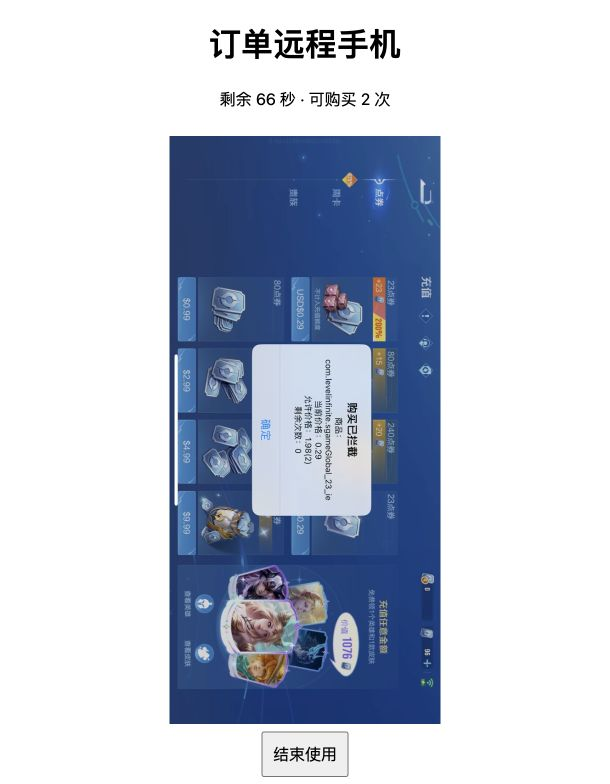
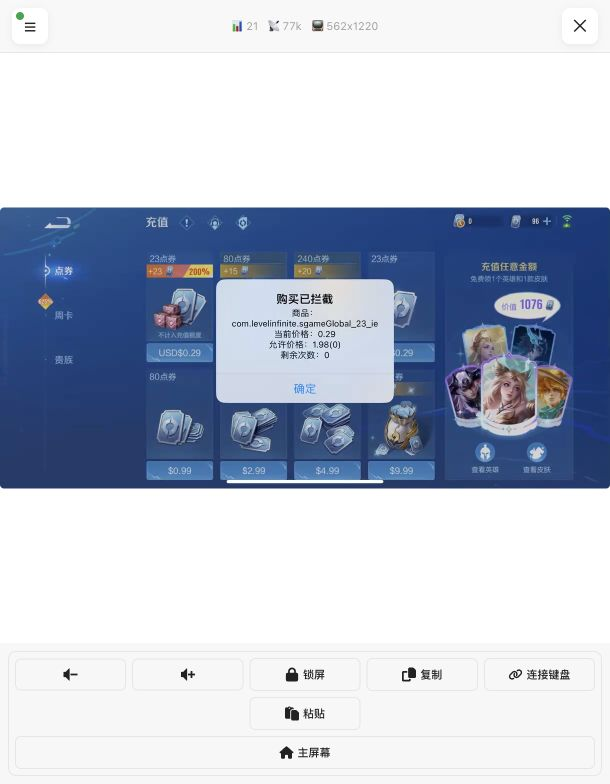

# 本次验收结论（2026-09-25）

## 真实手机与真实HTTP已通过

| 项目 | 实测证据 |
|---|---|
| 订单申请与自动准备 | Honor of Kings，订单接口返回200和专属URL，约1.4秒准备；Lua确认游戏进程和前台 |
| 动态价格与数量 | 不同订单1.99×1、1.98×2，手机实际runtime plist随请求改变；006拒绝后回读1.98仍为2 |
| 远控画面与触控 | 关闭电脑VPN后，专属viewer显示真实游戏，可关闭浮层并操作充值页面 |
| 价格不匹配 | 006订单1.98×2，点击0.29商品，实际弹窗“购买已拦截”，允许价格1.98(2)；拒绝不扣允许额度 |
| 零额度拒绝 | 1.98配额为0时，真实0.29请求仍被拒绝；这证明零额度期间未放行该请求，不等同于同价耗尽的完整支付验收 |
| 设备独占 | 使用中available_count=0；4个真实HTTP并发申请等待15秒后取消，没有新增会话 |
| 幂等与参数校验 | 同参数普通请求同URL/同expires；参数变化409；非法数量、金额、国家、币种格式400 |
| 自然到期 | 6分钟结束，原视频断开、旧token401、手机游戏关闭、配额0、pending_cleanup |
| 到期后的普通请求/重试 | 普通请求409；retry=true等待空闲设备，取消后没有复用待清理手机；availability=0及预计时间null |
| 主动提前结束 | 007新会话立即请求release，HTTP202，约2.04秒后pending_cleanup；真实手机报告stopped=true、remaining=0 |

弹窗中的“剩余次数0”指当前被拒绝商品的可用次数；006允许价格栏1.98(2)和plist回读均保留2次，不应误读为订单2次被扣光。

## 软件检查已通过

Go全量竞态测试、Lua模拟和前端构建通过。朋友原始IAPGuardConfig源码在macOS隔离测试路径验证了价格匹配、扣减落盘、次数耗尽；这不是iPhone StoreKit端到端购买验收。

完整HTTP数据见 [真实HTTP验证](HTTP_REAL_VALIDATION_2026-09-25.md)。

## 未完成的项目，不能列为通过

- **同价真实放行、放行后额度扣减以及同价次数耗尽的iPhone完整链路**：当前为真实游戏/真实支付环境，不能保证点击放行后不会扣款。本次明确不付款，因此需支持StoreKit沙盒的测试版本与测试账号后再验。原始配置源码的模拟通过不替代这项。
- **实际发货/到账**：未付款，未验证，不属于订单租用接口成功含义。
- **账号数据清理及跨用户复用**：按约定暂缓；只完成待清理隔离和人工确认接口的软件测试，没有清理或验证登录数据。
- **5台实体手机并发和厦门外网接入**：目前只有1台手机和本机loopback环境，只验证同一手机不会被并发抢占。

## 运行与测试记录

服务保持运行：`http://localhost:46980/`，本机测试模式。最终007为pending_cleanup、配额0，不自动出租给下一用户。

为了同一操作者多轮测试，记录在确认停流、关游戏、零配额后做了本地重置；每轮都保留before-honor备份和明确未清理账号的reason。该测试重置不是对外清理成功，也不能作为跨用户复用流程。

电脑VPN曾把手机WiFi/USB目标路由到utun7，导致ICE checking无视频；用户关闭VPN后真实远控恢复。若再次开启VPN，需要配置正确的局域网直连路由后复验。
