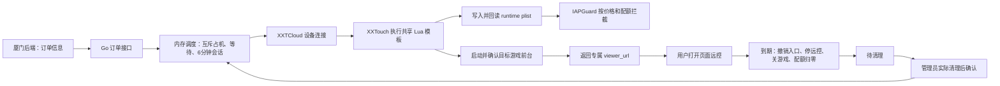

# 云手机订单接入：一期实现与联调

更新：2026-09-25。基于现有 Go + SolidJS XXTCloudControl，首个目标游戏为 Honor of Kings（`com.levelinfinite.sgameGlobal`）。

厦门只对接 [接口文档](XIAMEN_API.md)。以下内容用于内部开发、部署和验收。

## 架构与职责

- 调度在单 Go 进程内加锁，先占用再准备，避免重复分配。同订单并发变更受订单锁保护。
- 保留原 JSON 会话日志用于重启保护，没有引入数据库或 Redis。服务重启后未完成会话隔离，不能直接重新出租。
- XXTouch 提供设备脚本执行与远控；朋友的 IAPGuard 是实际拦截 StoreKit 1 的插件。
- `zzzIAPGuard.plist` 控制插件注入范围；`com.iapguard.runtime.plist` 存放订单限制。每单向同一 Lua 模板注入配置，无需重装 deb。
- 管理台保留原设备能力，并显示订单状态、价格、配额、到期时间、结束操作和人工清理确认。

## 一期业务行为

1. `POST /orders/v1/connect` 提交订单。无可用设备就等待，可因调用方断开而取消等待；没有 30 秒分配总截止。单条设备命令仍有独立超时。
2. 设备独占后检查原生脚本状态，写入价格/数量、回读确认，启动游戏并确认运行和前台 Bundle ID，再交付入口。前台确认不等于已验证游戏资源加载完成。
3. 价格为普通 JSON 数值，内部精确解析，`648`、`648.0`、`648.00` 等值。不使用浮点运算判定配额。
4. 一期只按价格和次数拦截；商品名、币种、国家是订单信息，同价格其他商品也可放行。币种不参与设备分配，也没有被插件验证。
5. 数量指允许进入 StoreKit 的购买请求次数，不是成功付款次数。取消或付款失败不会自动退还次数。
6. 使用上限 6 分钟。服务端从首次 ready 计时，手机从本地 ready 独立计时，存在轮询造成的秒级差异；手机可能提前少量秒结束。远控信令也受截止时间约束。
7. 到期撤销访问令牌、停止 WebRTC、关闭游戏、将配额置零并读回。现有连接由手机停流切断，旧链接不能重连；不是仅隐藏页面。
8. `GET /orders/v1/availability` 返回可用数和预计时间。截止时间不等于已清理可交付；待清理和异常设备不计为空闲，无法估算时返回 null。
9. 普通重复请求复用有效会话，主动 `retry=true` 创建新会话；旧手机停止已确认但待清理时可分配另一台空闲手机，旧手机仍被占用。停止未确认时禁止交付新会话。

状态：`preparing` → `active` → `closing` → `pending_cleanup` → 人工确认 → `completed`。异常为 `quarantined`，持续占用设备。配置了真实清理模块的正式档案可在清理验证成功后直接 completed。

## 清理边界

本轮不实现游戏登录数据清理。测试档案使用 `manual_test`，仅在停流、关游戏、配额归零全部确认后进入待清理。

管理页“确认已清理”调用管理员接口 `POST /api/order-sessions/:id/confirm-clean`，只允许 pending_cleanup；它记录管理员已经完成的清理，不会替管理员清理数据。未清理不得确认。关闭 App 不等于退出账号。

正式清理模块由 `cleanup_script` 指定，返回 `clean(bundle_id)` 和 `verify(bundle_id)`，分别执行清理和验证。不能无条件返回 true。清理范围应按游戏验证，不能无差别擦除手机。

## 本地运行

- 当前测试档案位于 `server/data/order-profiles.json`。修复版 IAPGuard 使用游戏数据容器内的 `Library/Preferences/com.iapguard.runtime.plist`，`policy_path` 必须与该路径一致；可通过 XXTouch `app.data_path(bundle_id)` 获取容器。游戏重装后须重新获取，不能照抄其他手机的 UUID。旧版全局 RootHide 路径在本次真机测试中被游戏拒绝写入，不能混用新插件和旧路径。
- 设置 `XXTCC_PUBLIC_URL=http://127.0.0.1:46980`、`XXTCC_LOCAL_ORDER_TEST=1` 启动；本机测试仅接受 loopback 请求，且只允许一个 manual_test 档案。
- 无需对接密钥或请求签名。专属远控入口仍有内部随机密钥生成的访问令牌；原管理台认证保留。
- 厦门正式联调需可访问的源站与已验收档案；当前 loopback URL 不能交付远端厦门用户。
- 手机需要先接入 XXTCloud。USB 扩展坞接线和供电本身不保证云控网络连接。
- 只允许一个服务实例负责同一批手机，不可用多实例共享 JSON 文件。不要删除会话日志来解除隔离。
- 管理员不要在订单期间同时操作手机或启动其他脚本；原管理通道尚未全部增加订单互斥。

## 验收

软件验证包括 Go 全量测试与竞态检查、Lua 模拟、前端构建。模拟不能代替真机验收。

真机依次检查：模拟厦门请求 → 自动打开指定游戏 → 返回页面实际画面与触控 → 读取运行时价格/数量 → 不同价购买请求被拦截（不付款）→ 6 分钟到期停流、关游戏、配额归零 → 旧链接拒绝 → 待清理不重新分配。数量耗尽及同价放行需在不产生实际支付的受控条件下另行验收。

尚未覆盖的正式运营条件：游戏账号清理、全部管理通道互斥、应用访问限制、5 台真实设备并发、不同网络的 WebRTC/TURN、StoreKit 2 与插件写回失败行为。
