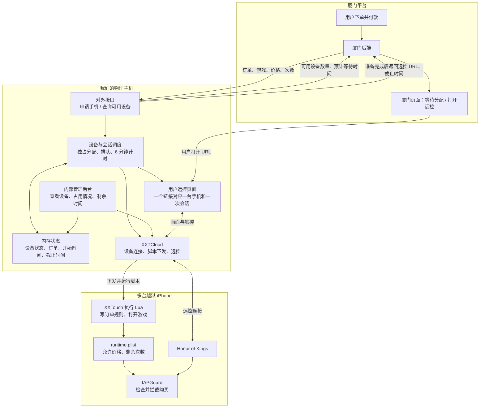

一期就确定为：**在现有 XXTCloud 项目上增加订单调度能力，用一个 Go 服务管理设备和会话，状态先放内存，先打通 Honor of Kings。** 以下是目标架构，不代表所有模块已经完成。



各部分的职责可以这样划分：

| 部分 | 负责什么 |
|---|---|
| **厦门平台** | 收款、提交订单、展示等待提示、把远控链接交给用户 |
| **我们的订单接口** | 接收订单，返回准备好的手机远控链接；提供设备可用情况查询 |
| **调度模块** | 原子地预留空闲设备，保证一台手机同一时间只属于一个会话 |
| **XXTCloud** | 复用现有设备连接、脚本下发和远控能力 |
| **Lua + plist** | 根据每次请求动态更新价格和次数，并打开游戏 |
| **IAPGuard** | 真正执行购买限制；一期允许同价商品，不区分商品 ID |
| **管理后台** | 查看设备在线状态、当前订单、使用时间、剩余时间及异常情况 |

一次请求的完整过程是：

1. 厦门提交订单，我们从内存设备列表中**锁定一台空闲手机**；没有空闲设备就等待。
2. 下发 Lua，写入本次价格和次数，打开游戏，确认手机准备完成。
3. 返回用户专用远控 URL 和 `expires_at`，**从此刻开始计时 6 分钟**。
4. 用户打开链接直接操控，购买行为由 IAPGuard 检查。
5. 到期后，服务端关闭已有远控连接、禁止旧链接重连，同时结束手机侧会话并将购买额度归零。
6. 设备进入待清理状态；清理完成后才重新进入空闲池。

设备状态按这条线管理：

```text
空闲 → 准备中 → 使用中 → 待清理 → 空闲
                 │
           发生异常 → 异常停用
```

一期先做三个交付项：

| 顺序 | 交付内容 | 验收标准 |
|---|---|---|
| 1 | 自动调度与远控链接 | 并发请求不会拿到同一台手机，链接打开即可操控 |
| 2 | 动态规则与限时 | 请求价格、次数真实生效；6 分钟后旧连接和旧链接都不可用 |
| 3 | 设备查询与管理展示 | 能看到空闲数量、当前占用、剩余时间和预计可用时间 |

**自动账号清理按你的安排放到最后研究。** 在它完成前，测试结束的设备先由我们手动确认清理，再恢复空闲；预计可用时间也要注明仍受清理影响。

内存方案按**单个 Go 服务实例**实现即可。重启后先重新核验手机状态，不把刚连接回来的设备直接当成空闲。这样不需要一期就增加数据库或 Redis，也能保持调度规则明确。
